<div dir="rtl">
    <h2>
       فاز سوم پروژه بازیابی اطلاعات - خوشه‌بندی
    </h2>
</div>
<p></p>
<div dir="rtl">
اعضای گروه: حمیدرضا هدایتی، حامد علی‌محمدزاده، آرمین سعادت‌بروجنی
<p></p><p></p><p></p><p></p>
</div>
<p></p><p></p><p></p><p></p>

<div dir="rtl">
<p></p><p></p><p></p><p></p>
    اجرای این نوتبوک ۲۰ دقیقه زمان می‌برد که ۱۵ دقیقه آن مربوط به تعیین مقدار مناسب hyper_parameter ها است که عملا ۱ بار انجام شود کافی است.
</div>

<div dir="rtl">
    <h3>
       نصب نیازمندی‌های پروژه:
    </h3>
</div>


```python
%cd ../../
%ls
```

    /home/rmool/MIR
    classifiers/  data/          IR_files/    __pycache__/      search/
    clusterings/  file_handler/  main.py      README.md         venv/
    compressor/   helper.py      pagerank/    reports/
    crawler/      index/         preprocess/  requirements.txt


```python
!pip install -r requirements.txt
!pip install yellowbrick
```

    Requirement already satisfied: scipy in /home/rmool/.local/lib/python3.7/site-packages (from -r requirements.txt (line 1)) (1.5.2)
    Requirement already satisfied: matplotlib in /home/rmool/.local/lib/python3.7/site-packages (from -r requirements.txt (line 2)) (3.3.2)
    Requirement already satisfied: numpy in /home/rmool/.local/lib/python3.7/site-packages (from -r requirements.txt (line 3)) (1.17.3)
    Requirement already satisfied: hazm==0.7.0 in /home/rmool/miniconda3/lib/python3.7/site-packages (from -r requirements.txt (line 4)) (0.7.0)
    Requirement already satisfied: pandas==1.1.3 in /home/rmool/miniconda3/lib/python3.7/site-packages (from -r requirements.txt (line 5)) (1.1.3)
    Requirement already satisfied: nltk==3.3 in /home/rmool/miniconda3/lib/python3.7/site-packages (from -r requirements.txt (line 6)) (3.3)
    Requirement already satisfied: tk==0.1.0 in /home/rmool/miniconda3/lib/python3.7/site-packages (from -r requirements.txt (line 7)) (0.1.0)
    Requirement already satisfied: scikit-learn==0.23.2 in /home/rmool/miniconda3/lib/python3.7/site-packages (from -r requirements.txt (line 8)) (0.23.2)
    Requirement already satisfied: gensim==3.8.3 in /home/rmool/miniconda3/lib/python3.7/site-packages (from -r requirements.txt (line 9)) (3.8.3)
    Requirement already satisfied: selenium==3.141.0 in /home/rmool/miniconda3/lib/python3.7/site-packages (from -r requirements.txt (line 10)) (3.141.0)
    Requirement already satisfied: networkx==2.5 in /home/rmool/miniconda3/lib/python3.7/site-packages (from -r requirements.txt (line 11)) (2.5)
    Requirement already satisfied: kiwisolver>=1.0.1 in /home/rmool/.local/lib/python3.7/site-packages (from matplotlib->-r requirements.txt (line 2)) (1.2.0)
    Requirement already satisfied: certifi>=2020.06.20 in /home/rmool/.local/lib/python3.7/site-packages (from matplotlib->-r requirements.txt (line 2)) (2020.6.20)
    Requirement already satisfied: pyparsing!=2.0.4,!=2.1.2,!=2.1.6,>=2.0.3 in /home/rmool/.local/lib/python3.7/site-packages (from matplotlib->-r requirements.txt (line 2)) (2.4.7)
    Requirement already satisfied: cycler>=0.10 in /home/rmool/.local/lib/python3.7/site-packages (from matplotlib->-r requirements.txt (line 2)) (0.10.0)
    Requirement already satisfied: python-dateutil>=2.1 in /home/rmool/miniconda3/lib/python3.7/site-packages (from matplotlib->-r requirements.txt (line 2)) (2.8.1)
    Requirement already satisfied: pillow>=6.2.0 in /home/rmool/.local/lib/python3.7/site-packages (from matplotlib->-r requirements.txt (line 2)) (7.2.0)
    Requirement already satisfied: libwapiti>=0.2.1; platform_system != "Windows" in /home/rmool/miniconda3/lib/python3.7/site-packages (from hazm==0.7.0->-r requirements.txt (line 4)) (0.2.1)
    Requirement already satisfied: pytz>=2017.2 in /home/rmool/miniconda3/lib/python3.7/site-packages (from pandas==1.1.3->-r requirements.txt (line 5)) (2020.1)
    Requirement already satisfied: six in /home/rmool/miniconda3/lib/python3.7/site-packages (from nltk==3.3->-r requirements.txt (line 6)) (1.12.0)
    Requirement already satisfied: joblib>=0.11 in /home/rmool/miniconda3/lib/python3.7/site-packages (from scikit-learn==0.23.2->-r requirements.txt (line 8)) (0.17.0)
    Requirement already satisfied: threadpoolctl>=2.0.0 in /home/rmool/miniconda3/lib/python3.7/site-packages (from scikit-learn==0.23.2->-r requirements.txt (line 8)) (2.1.0)
    Requirement already satisfied: smart-open>=1.8.1 in /home/rmool/miniconda3/lib/python3.7/site-packages (from gensim==3.8.3->-r requirements.txt (line 9)) (4.1.2)
    Requirement already satisfied: urllib3 in /home/rmool/miniconda3/lib/python3.7/site-packages (from selenium==3.141.0->-r requirements.txt (line 10)) (1.24.2)
    Requirement already satisfied: decorator>=4.3.0 in /home/rmool/miniconda3/lib/python3.7/site-packages (from networkx==2.5->-r requirements.txt (line 11)) (4.4.1)
    Requirement already satisfied: yellowbrick in /home/rmool/miniconda3/lib/python3.7/site-packages (1.2.1)
    Requirement already satisfied: cycler>=0.10.0 in /home/rmool/.local/lib/python3.7/site-packages (from yellowbrick) (0.10.0)
    Requirement already satisfied: scipy<1.6,>=1.0.0 in /home/rmool/.local/lib/python3.7/site-packages (from yellowbrick) (1.5.2)
    Requirement already satisfied: scikit-learn<0.24,>=0.20 in /home/rmool/miniconda3/lib/python3.7/site-packages (from yellowbrick) (0.23.2)
    Requirement already satisfied: numpy>=1.13.0 in /home/rmool/.local/lib/python3.7/site-packages (from yellowbrick) (1.17.3)
    Requirement already satisfied: matplotlib!=3.0.0,>=2.0.2 in /home/rmool/.local/lib/python3.7/site-packages (from yellowbrick) (3.3.2)
    Requirement already satisfied: six in /home/rmool/miniconda3/lib/python3.7/site-packages (from cycler>=0.10.0->yellowbrick) (1.12.0)
    Requirement already satisfied: joblib>=0.11 in /home/rmool/miniconda3/lib/python3.7/site-packages (from scikit-learn<0.24,>=0.20->yellowbrick) (0.17.0)
    Requirement already satisfied: threadpoolctl>=2.0.0 in /home/rmool/miniconda3/lib/python3.7/site-packages (from scikit-learn<0.24,>=0.20->yellowbrick) (2.1.0)
    Requirement already satisfied: pillow>=6.2.0 in /home/rmool/.local/lib/python3.7/site-packages (from matplotlib!=3.0.0,>=2.0.2->yellowbrick) (7.2.0)
    Requirement already satisfied: pyparsing!=2.0.4,!=2.1.2,!=2.1.6,>=2.0.3 in /home/rmool/.local/lib/python3.7/site-packages (from matplotlib!=3.0.0,>=2.0.2->yellowbrick) (2.4.7)
    Requirement already satisfied: python-dateutil>=2.1 in /home/rmool/miniconda3/lib/python3.7/site-packages (from matplotlib!=3.0.0,>=2.0.2->yellowbrick) (2.8.1)
    Requirement already satisfied: certifi>=2020.06.20 in /home/rmool/.local/lib/python3.7/site-packages (from matplotlib!=3.0.0,>=2.0.2->yellowbrick) (2020.6.20)
    Requirement already satisfied: kiwisolver>=1.0.1 in /home/rmool/.local/lib/python3.7/site-packages (from matplotlib!=3.0.0,>=2.0.2->yellowbrick) (1.2.0)


<div dir="rtl">
    <h3>
        ایمپورت کردن پکیج‌های مورد نیاز:
    </h3>
</div>


```python
from main import JSON_to_clustering_arrays 
from yellowbrick.cluster import intercluster_distance, kelbow_visualizer
from clusterings import k_means, gmm
from sklearn.cluster import KMeans
from sklearn.decomposition import PCA
from clusterings import hierarchical
import seaborn as sns
import matplotlib.pyplot as plt
import pandas as pd
import numpy as np


import warnings
warnings.filterwarnings('ignore')
```

    [nltk_data] Downloading package punkt to /home/rmool/nltk_data...
    [nltk_data]   Package punkt is already up-to-date!
    [nltk_data] Downloading package wordnet to /home/rmool/nltk_data...
    [nltk_data]   Package wordnet is already up-to-date!


<div dir="rtl">
    <h3>
       تحلیل اطلاعات فایل جیسون و ایجاد w2v و tf_idf:
    </h3>
<p></p>    
لینک‌ها خوانده و ذخیره می‌شود. تگ‌های اصلی با شماره ۰ تا ۱۳ ذخیره می‌شود.
<p></p>
summery و title با هم ترکیب شده و به فضایTF_IDF و Word2Vec برده می‌شود.
<p></p>
    برای TF_IDF در گام اول بعد فضا برابر تعداد term ها در نظر گرفته می‌شود. در گام بعد با استفاده از PCA کاهش ابعاد صورت می‌گیرد چرا که فاصله در ابعاد بالا مبنای خوبی برای الگوریتم k_means نیست.
<p></p>
    تبدیل Word2Vec توسط کتابخانه موجود با پارامترهای پیش‌فرض انجام می‌شود. تنها پارامتری که باید تعیین شود ابعاد فضا است که عددی زیر ۱۰۰ در نظر گفته می‌شود.
</div>


```python
tf_idf, w2v, tags, links, df = JSON_to_clustering_arrays("./data/phase3/hamshahri.json")
```


```python
features_dim = 50
random_state = 12
tf_idf = PCA(features_dim, random_state=random_state).fit_transform(tf_idf)
```

<div dir="rtl">
    <h2>
        بررسی پارامترهای k_means:
    </h2>
    <p></p>
    KMeans(n_clusters=n_clusters, random_state=random_state, n_init=10, max_iter=300)
    <p></p>
    random_state یک عدد دلخواه تعیین می‌شود تا با ثابت ماندن بقیه پارامترها جواب یکسان گرفته شود.
    <p></p>
    در گام اول تعداد خوشه‌ها (n_clusters) تعیین می‌شود.
</div>

<div dir="rtl">
    <h4>
        محاسبه تعداد خوشه‌ها بدون استفاده از tags:
    </h4>
    <p></p>
    نمودار تابع هزینه (مجموع مجذور فاصله هر نقطه از مرکز) بر حسب تعداد خوشه‌ها رسم می‌شود.
</div>


```python
inertia_tfidf = []
for i in range(2, 20):
    inertia_tfidf.append(k_means.get_cost(tf_idf, random_state=random_state, n_clusters=i))
print('TF-IDF:')
ax = sns.lineplot(x=range(2, 20), y=inertia_tfidf);
ax.set(xlabel='n_clusters', ylabel='inertia')
plt.show()

inertia_w2v = []
for i in range(2, 20):
    inertia_w2v.append(k_means.get_cost(w2v, random_state=random_state, n_clusters=i))
print('W2v:')
ax = sns.lineplot(x=range(2, 20), y=inertia_w2v);
ax.set(xlabel='n_clusters', ylabel='inertia')
plt.show()
```

    TF-IDF:


    W2v:


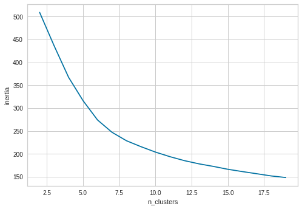


<div dir="rtl">
    همانطور که انتظار میرفت با افزایش تعداد خوشه‌ها، هزینه کمتر شد. اما به دنبال نقطه‌ای هستیم که کاهش معناداری داشته باشد که از نمودارهای بالا به دست نیامد.
<p></p>
    برای دقت بیشتر و در نظر گرفتن زمان مورد نیاز برای رسیدن به جواب، میتوان از  Elbow method استفاده کرد.
</div>


```python
print('TF_IDF:')
_ = kelbow_visualizer(KMeans(random_state=random_state), tf_idf, k=(2,16), metric='silhouette');
print('Word2Vec:')
_ = kelbow_visualizer(KMeans(random_state=random_state), w2v, k=(2,16), metric='silhouette');
```

    TF_IDF:


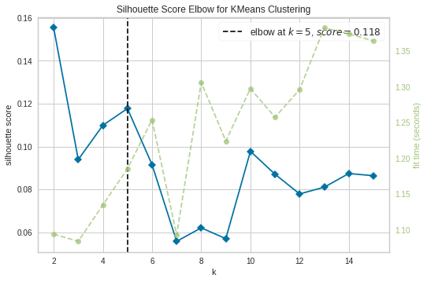


    Word2Vec:


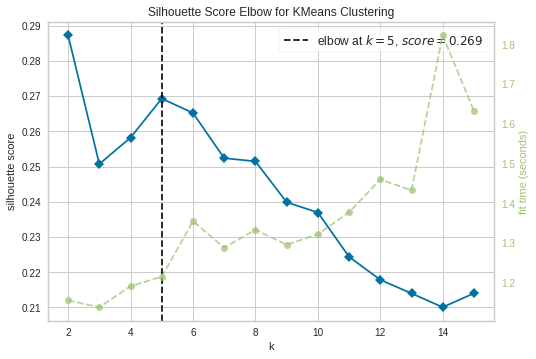


<div dir="rtl">
    بنابراین تعداد خوشه‌ها در هر دو روش ۵ به دست آمد.
<p></p>
    با مقدار پیش‌فرض پارامترهای KMeans خوشه‌بندی را انجام داده و نتایج ارزیابی را نمایش می‌دهیم. 
</div>


```python
k_means.get_evaluation_dataframe(tf_idf, w2v, tags, 5, 5)
```


<div>
<style scoped>
    .dataframe tbody tr th:only-of-type {
        vertical-align: middle;
    }

    .dataframe tbody tr th {
        vertical-align: top;
    }

    .dataframe thead th {
        text-align: right;
    }
</style>
<table border="1" class="dataframe">
  <thead>
    <tr style="text-align: right;">
      <th></th>
      <th>Purity</th>
      <th>Adjusted Mutual Info</th>
      <th>Normalized Mutual Info</th>
      <th>Adjusted Rand Index</th>
      <th>Inertia</th>
    </tr>
  </thead>
  <tbody>
    <tr>
      <th>tf_idf</th>
      <td>0.290513</td>
      <td>0.114225</td>
      <td>0.121537</td>
      <td>-0.000750</td>
      <td>431.672184</td>
    </tr>
    <tr>
      <th>w2v</th>
      <td>0.495688</td>
      <td>0.356798</td>
      <td>0.361104</td>
      <td>0.196776</td>
      <td>316.168384</td>
    </tr>
  </tbody>
</table>
</div>


<div dir="rtl">
    برای افزایش کیفیت خوشه‌بندی، میتوان تعداد ابعاد را کمی بیشتر کرد.
    <p></p>
    در مورد w2v، با افزایش بعد مقدار epoches نیز از ۱۰ به ۳۲ افزایش یافت تا ویژگی‌های جدید بهتر آموخته شوند.
    <p></p>
    مشابه این فرایند برای tf_idf نیز اعمال شد. فضا از ۵۰ به ۴۰۰ تغییر یافت و برای رسیدن به نتیجه مطلوب تعداد حالات بیشتری (با randomness بیشتر ) بررسی شد.
</div>


```python
enhanced_tfidf, enhanced_w2v, tags, links, df = JSON_to_clustering_arrays("./data/phase3/hamshahri.json", tf_idf_features=1000, w2v_min_count=2, w2v_epochs=32, w2v_vector_size=128)
```


```python
features_dim = 400
enhanced_tfidf = PCA(features_dim, random_state=random_state).fit_transform(enhanced_tfidf)
```


```python
results, best_random_tfidf, best_random_w2v = k_means.get_advanced_results(enhanced_tfidf, enhanced_w2v, tags, 5, 5)
results
```


<div>
<style scoped>
    .dataframe tbody tr th:only-of-type {
        vertical-align: middle;
    }

    .dataframe tbody tr th {
        vertical-align: top;
    }

    .dataframe thead th {
        text-align: right;
    }
</style>
<table border="1" class="dataframe">
  <thead>
    <tr style="text-align: right;">
      <th></th>
      <th>Purity</th>
      <th>Adjusted Mutual Info</th>
      <th>Normalized Mutual Info</th>
      <th>Adjusted Rand Index</th>
      <th>Inertia</th>
    </tr>
  </thead>
  <tbody>
    <tr>
      <th>tf_idf</th>
      <td>0.382660</td>
      <td>0.241917</td>
      <td>0.247642</td>
      <td>0.049169</td>
      <td>1614.210608</td>
    </tr>
    <tr>
      <th>w2v</th>
      <td>0.506582</td>
      <td>0.427252</td>
      <td>0.431067</td>
      <td>0.269551</td>
      <td>6146.536664</td>
    </tr>
  </tbody>
</table>
</div>


<div dir="rtl">
    همانطور که مشاهده می‌شود نتایج به شکل معناداری بهبود یافت. دلیل اصلی این بهبود افزایش بعد نیست بلکه اجرای الگوریتم با نقاط شروع متفاوت و با random_state های متفاوت است که باعث می‌شود نقاط بهینه محلی بیشتری را بررسی کرده و بهترین آن‌ها را به عنوان بهینه اصلی انتخاب کند.
    <p></p><p></p>
    در زیر خوشه‌ها بر اساس رنگ مشخص شده‌اند. این نمایش بر حسب ۲ ویژگی بارز شناسایی شده توسط PCA است.
</div>


```python
k_means.PCA2_plot(enhanced_tfidf, 5, best_random_tfidf, tags, "PCA Reduction of TF_IDF")
k_means.PCA2_plot(enhanced_w2v, 5, best_random_w2v, tags, "PCA Reduction of Word2Vec")
```


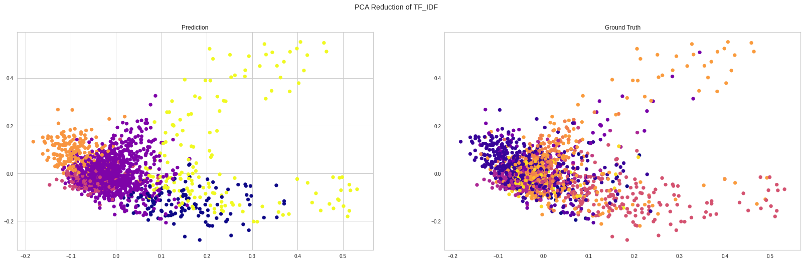


<div dir="rtl">
    موقعیت خوشه‌ها نسبت به هم با معیار فاصله بین خوشه‌ای به شکل زیر است:
</div>


```python
print('TF_IDF:')
_ = intercluster_distance(KMeans(n_clusters=5, random_state=best_random_tfidf), enhanced_tfidf)
print('Word2Vec:')
_ = intercluster_distance(KMeans(n_clusters=5, random_state=best_random_w2v), enhanced_w2v)
```

    TF_IDF:


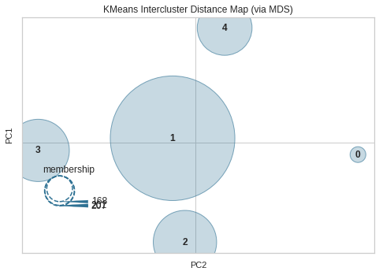


    Word2Vec:


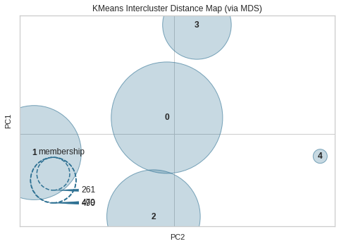


<div dir="rtl">
    <h4>
        محاسبه تعداد خوشه‌ها با استفاده از tags:
    </h4>
    <p></p>
    دسته‌های اصلی به عنوان ground truth استفاده می‌شوند. تعداد این دسته‌ها ۱۴ تاست پس تعداد خوشه‌ها برابر ۱۴ هم امتحان می‌کنیم.
</div>


```python
k_means.get_evaluation_dataframe(tf_idf, w2v, tags, 14, 14)
```


<div>
<style scoped>
    .dataframe tbody tr th:only-of-type {
        vertical-align: middle;
    }

    .dataframe tbody tr th {
        vertical-align: top;
    }

    .dataframe thead th {
        text-align: right;
    }
</style>
<table border="1" class="dataframe">
  <thead>
    <tr style="text-align: right;">
      <th></th>
      <th>Purity</th>
      <th>Adjusted Mutual Info</th>
      <th>Normalized Mutual Info</th>
      <th>Adjusted Rand Index</th>
      <th>Inertia</th>
    </tr>
  </thead>
  <tbody>
    <tr>
      <th>tf_idf</th>
      <td>0.469360</td>
      <td>0.280925</td>
      <td>0.294606</td>
      <td>0.104216</td>
      <td>353.467633</td>
    </tr>
    <tr>
      <th>w2v</th>
      <td>0.556968</td>
      <td>0.368072</td>
      <td>0.378694</td>
      <td>0.204612</td>
      <td>172.532234</td>
    </tr>
  </tbody>
</table>
</div>


<div dir="rtl">
    <h4>
        نتایج برگزیده k_means:
    </h4>
</div>


```python
kmeans_results, best_random_tfidf, best_random_w2v = k_means.get_advanced_results(tf_idf, enhanced_w2v, tags, 14, 14)
kmeans_results
```


<div>
<style scoped>
    .dataframe tbody tr th:only-of-type {
        vertical-align: middle;
    }

    .dataframe tbody tr th {
        vertical-align: top;
    }

    .dataframe thead th {
        text-align: right;
    }
</style>
<table border="1" class="dataframe">
  <thead>
    <tr style="text-align: right;">
      <th></th>
      <th>Purity</th>
      <th>Adjusted Mutual Info</th>
      <th>Normalized Mutual Info</th>
      <th>Adjusted Rand Index</th>
      <th>Inertia</th>
    </tr>
  </thead>
  <tbody>
    <tr>
      <th>tf_idf</th>
      <td>0.474353</td>
      <td>0.287757</td>
      <td>0.300890</td>
      <td>0.102612</td>
      <td>354.817662</td>
    </tr>
    <tr>
      <th>w2v</th>
      <td>0.785293</td>
      <td>0.626236</td>
      <td>0.632622</td>
      <td>0.422076</td>
      <td>4549.884757</td>
    </tr>
  </tbody>
</table>
</div>


<div dir="rtl">
    مشاهده می‌شود که عملکرد خوشه‌بندی با ۱۴ خوشه بهبود می‌یابد.
</div>


```python
k_means.PCA2_plot(tf_idf, 14, best_random_tfidf, tags, "PCA Reduction of TF_IDF")
k_means.PCA2_plot(enhanced_w2v, 14, best_random_w2v, tags, "PCA Reduction of Word2Vec")
```


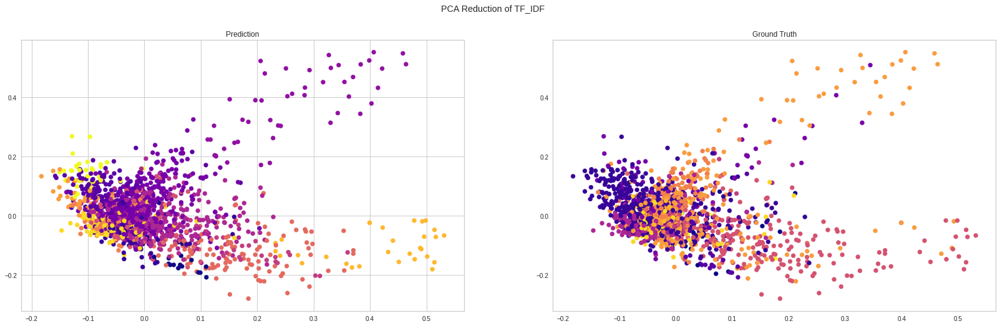


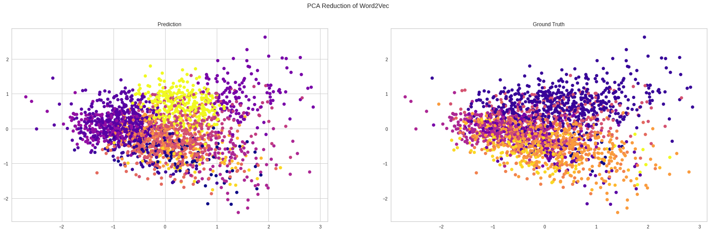


```python
print('TF_IDF:')
_ = intercluster_distance(KMeans(n_clusters=14, random_state=best_random_tfidf), tf_idf)
print('Word2Vec:')
_ = intercluster_distance(KMeans(n_clusters=14, random_state=best_random_w2v), enhanced_w2v)
```

    TF_IDF:


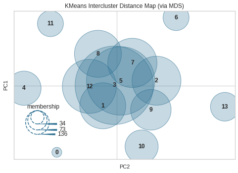


    Word2Vec:


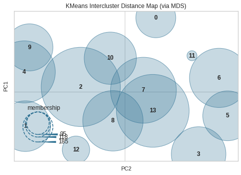


<div dir="rtl">
    همانطور که از نمودار بالا برداشت می‌شود، روش w2v خیلی بهتر خوشه‌ها را از هم تفکیک کرده است.
</div>

<div dir="rtl">
    <h4>
        بررسی سایر پارامترها: n_init و max_iter
    </h4>
    <p></p>
    تا اینجا این مقادیر به صورت پیش‌فرض به ترتیب ۱۰ و ۳۰۰ بوده‌اند.
    <p></p>
    n_init تعداد بارهایی است که به ازای هر بار صدا زدن تابع KMeans الگوریتم انجام شده و بهترین جواب بازگردانده می‌شود.
    <p></p>
    max_iter حداکثر تعداد مراحلی است که در هر بار اجرای الگوریتم طی می‌شود.
    <p></p>
    <h5>
        بررسی n_init:
    </h5>
</div>


```python
k_means.evaluate_n_init(tf_idf, enhanced_w2v, tags, 14, 14, best_random_tfidf, best_random_w2v, [1, 5, 10, 20, 30])    
```


<div>
<style scoped>
    .dataframe tbody tr th:only-of-type {
        vertical-align: middle;
    }

    .dataframe tbody tr th {
        vertical-align: top;
    }

    .dataframe thead th {
        text-align: right;
    }
</style>
<table border="1" class="dataframe">
  <thead>
    <tr style="text-align: right;">
      <th></th>
      <th>n_init</th>
      <th>Purity</th>
      <th>Adjusted Mutual Info</th>
      <th>Normalized Mutual Info</th>
      <th>Adjusted Rand Index</th>
      <th>Inertia</th>
    </tr>
    <tr>
      <th>vector</th>
      <th></th>
      <th></th>
      <th></th>
      <th></th>
      <th></th>
      <th></th>
    </tr>
  </thead>
  <tbody>
    <tr>
      <th>tf_idf</th>
      <td>1</td>
      <td>0.474353</td>
      <td>0.287757</td>
      <td>0.300890</td>
      <td>0.102612</td>
      <td>354.817662</td>
    </tr>
    <tr>
      <th>tf_idf</th>
      <td>5</td>
      <td>0.474353</td>
      <td>0.287757</td>
      <td>0.300890</td>
      <td>0.102612</td>
      <td>354.817662</td>
    </tr>
    <tr>
      <th>tf_idf</th>
      <td>10</td>
      <td>0.474353</td>
      <td>0.287757</td>
      <td>0.300890</td>
      <td>0.102612</td>
      <td>354.817662</td>
    </tr>
    <tr>
      <th>tf_idf</th>
      <td>20</td>
      <td>0.474353</td>
      <td>0.287757</td>
      <td>0.300890</td>
      <td>0.102612</td>
      <td>354.817662</td>
    </tr>
    <tr>
      <th>tf_idf</th>
      <td>30</td>
      <td>0.474353</td>
      <td>0.287757</td>
      <td>0.300890</td>
      <td>0.102612</td>
      <td>354.817662</td>
    </tr>
    <tr>
      <th>w2v</th>
      <td>1</td>
      <td>0.785293</td>
      <td>0.626236</td>
      <td>0.632622</td>
      <td>0.422076</td>
      <td>4549.884757</td>
    </tr>
    <tr>
      <th>w2v</th>
      <td>5</td>
      <td>0.785293</td>
      <td>0.626236</td>
      <td>0.632622</td>
      <td>0.422076</td>
      <td>4549.884757</td>
    </tr>
    <tr>
      <th>w2v</th>
      <td>10</td>
      <td>0.785293</td>
      <td>0.626236</td>
      <td>0.632622</td>
      <td>0.422076</td>
      <td>4549.884757</td>
    </tr>
    <tr>
      <th>w2v</th>
      <td>20</td>
      <td>0.785293</td>
      <td>0.626236</td>
      <td>0.632622</td>
      <td>0.422076</td>
      <td>4549.884757</td>
    </tr>
    <tr>
      <th>w2v</th>
      <td>30</td>
      <td>0.785293</td>
      <td>0.626236</td>
      <td>0.632622</td>
      <td>0.422076</td>
      <td>4549.884757</td>
    </tr>
  </tbody>
</table>
</div>


<div dir="rtl">
    از آنجا که در کد با چندین random_state حالات مختلف بررسی شده و بهترین آن‌ها انتخاب می‌شود، به نوعی همان کار n_init دارد دستی انجام می‌شود و دیگر تاثیر چندانی ندارد. به جز در یک مورد که برای w2v با n_init=1 مقدار غیر بهینه به دست آمده است که آن هم با تکرار مجدد برطرف می‌شود.
    نتیجه اینکه n_init بیشتر از حدودا ۵ صرفا بار محاسبات را افزایش می‌دهد و تاثیر مثبتی ندارد.
    <p></p>
    <h5>
        بررسی max_iter:
    </h5>
</div>


```python
k_means.evaluate_max_iter(tf_idf, enhanced_w2v, tags, 14, 14, best_random_tfidf, best_random_w2v, [10, 50, 100, 300, 500])    
```


<div>
<style scoped>
    .dataframe tbody tr th:only-of-type {
        vertical-align: middle;
    }

    .dataframe tbody tr th {
        vertical-align: top;
    }

    .dataframe thead th {
        text-align: right;
    }
</style>
<table border="1" class="dataframe">
  <thead>
    <tr style="text-align: right;">
      <th></th>
      <th>max_iter</th>
      <th>Purity</th>
      <th>Adjusted Mutual Info</th>
      <th>Normalized Mutual Info</th>
      <th>Adjusted Rand Index</th>
      <th>Inertia</th>
    </tr>
    <tr>
      <th>vector</th>
      <th></th>
      <th></th>
      <th></th>
      <th></th>
      <th></th>
      <th></th>
    </tr>
  </thead>
  <tbody>
    <tr>
      <th>tf_idf</th>
      <td>10</td>
      <td>0.439855</td>
      <td>0.237507</td>
      <td>0.251531</td>
      <td>0.087962</td>
      <td>358.027932</td>
    </tr>
    <tr>
      <th>tf_idf</th>
      <td>50</td>
      <td>0.439855</td>
      <td>0.248944</td>
      <td>0.263092</td>
      <td>0.077077</td>
      <td>355.622083</td>
    </tr>
    <tr>
      <th>tf_idf</th>
      <td>100</td>
      <td>0.474353</td>
      <td>0.287757</td>
      <td>0.300890</td>
      <td>0.102612</td>
      <td>354.817662</td>
    </tr>
    <tr>
      <th>tf_idf</th>
      <td>300</td>
      <td>0.474353</td>
      <td>0.287757</td>
      <td>0.300890</td>
      <td>0.102612</td>
      <td>354.817662</td>
    </tr>
    <tr>
      <th>tf_idf</th>
      <td>500</td>
      <td>0.474353</td>
      <td>0.287757</td>
      <td>0.300890</td>
      <td>0.102612</td>
      <td>354.817662</td>
    </tr>
    <tr>
      <th>w2v</th>
      <td>10</td>
      <td>0.766682</td>
      <td>0.606185</td>
      <td>0.612846</td>
      <td>0.378926</td>
      <td>4563.920200</td>
    </tr>
    <tr>
      <th>w2v</th>
      <td>50</td>
      <td>0.785293</td>
      <td>0.626236</td>
      <td>0.632622</td>
      <td>0.422076</td>
      <td>4549.884757</td>
    </tr>
    <tr>
      <th>w2v</th>
      <td>100</td>
      <td>0.785293</td>
      <td>0.626236</td>
      <td>0.632622</td>
      <td>0.422076</td>
      <td>4549.884757</td>
    </tr>
    <tr>
      <th>w2v</th>
      <td>300</td>
      <td>0.785293</td>
      <td>0.626236</td>
      <td>0.632622</td>
      <td>0.422076</td>
      <td>4549.884757</td>
    </tr>
    <tr>
      <th>w2v</th>
      <td>500</td>
      <td>0.785293</td>
      <td>0.626236</td>
      <td>0.632622</td>
      <td>0.422076</td>
      <td>4549.884757</td>
    </tr>
  </tbody>
</table>
</div>


<div dir="rtl">
    برای مقادیر ۱۰ و ۵۰ که کمتر از حالت پیش‌فرض هستند مقادیر غیر بهینه به دست آمد. اما برای مقادیر بیشتر از ۱۰۰ الگوریتم قبل از رسیدن به max_iter همگرا شده است. در کل چون در این مسئله خیلی زود همگرایی اتفاق رخ می‌دهد max_iter چندان تاثیری ندارد.
    <p></p>
</div>

<div dir="rtl">
    <h2>
        بررسی پارامترهای gmm:
    </h2>
    <p></p>
    GMM دارای ۲ هایپرپارامتر مهم است: n_components, covariance_type
    <p></p>
    در k_means تعداد خوشه‌ها به صورت تجربی ۵ به دست آمد. از طرفی میدانیم ۱۴ دسته اصلی داریم. پس مقدار n_compenents را بین مقادیر ۵ تا ۱۵ بررسی میکنیم.
    <p></p>
    covariance_type چهار حالت دارد که هر ۴ مورد را بررسی میکنیم: full, tied, diag, spherical
    <p></p>
    این فرآیند برای هر دو حالت enhanced_tfidf و tf_idf انجام می‌شود تا تاثیر بعد فضا هم بررسی شود.
    <p></p>
    این کارها به ازای tf_idf و w2v انجام می‌شود.
    <p></p>
    بنابراین ۲ * ۲ * ۴ * ۱۱ یعنی ۱۷۶ حالت باید بررسی شود.
</div>


```python
AMI_results = gmm.get_result_df(tf_idf, w2v, tags)
AMI_results_higher_dim = gmm.get_result_df(enhanced_tfidf, enhanced_w2v, tags)
```


```python
AMI_results.query('vector == "tf_idf" and metric == "AMI"').sort_values(by=['score'], ascending=False).head(10)
```


<div>
<style scoped>
    .dataframe tbody tr th:only-of-type {
        vertical-align: middle;
    }

    .dataframe tbody tr th {
        vertical-align: top;
    }

    .dataframe thead th {
        text-align: right;
    }
</style>
<table border="1" class="dataframe">
  <thead>
    <tr style="text-align: right;">
      <th></th>
      <th>vector</th>
      <th>n_components</th>
      <th>covariance_type</th>
      <th>max_iter</th>
      <th>score</th>
      <th>metric</th>
    </tr>
  </thead>
  <tbody>
    <tr>
      <th>48</th>
      <td>tf_idf</td>
      <td>10</td>
      <td>full</td>
      <td>100</td>
      <td>0.286060</td>
      <td>AMI</td>
    </tr>
    <tr>
      <th>32</th>
      <td>tf_idf</td>
      <td>9</td>
      <td>full</td>
      <td>100</td>
      <td>0.279462</td>
      <td>AMI</td>
    </tr>
    <tr>
      <th>112</th>
      <td>tf_idf</td>
      <td>14</td>
      <td>full</td>
      <td>100</td>
      <td>0.276425</td>
      <td>AMI</td>
    </tr>
    <tr>
      <th>80</th>
      <td>tf_idf</td>
      <td>12</td>
      <td>full</td>
      <td>100</td>
      <td>0.273811</td>
      <td>AMI</td>
    </tr>
    <tr>
      <th>64</th>
      <td>tf_idf</td>
      <td>11</td>
      <td>full</td>
      <td>100</td>
      <td>0.272865</td>
      <td>AMI</td>
    </tr>
    <tr>
      <th>96</th>
      <td>tf_idf</td>
      <td>13</td>
      <td>full</td>
      <td>100</td>
      <td>0.268926</td>
      <td>AMI</td>
    </tr>
    <tr>
      <th>52</th>
      <td>tf_idf</td>
      <td>10</td>
      <td>tied</td>
      <td>100</td>
      <td>0.267124</td>
      <td>AMI</td>
    </tr>
    <tr>
      <th>36</th>
      <td>tf_idf</td>
      <td>9</td>
      <td>tied</td>
      <td>100</td>
      <td>0.257653</td>
      <td>AMI</td>
    </tr>
    <tr>
      <th>16</th>
      <td>tf_idf</td>
      <td>8</td>
      <td>full</td>
      <td>100</td>
      <td>0.256914</td>
      <td>AMI</td>
    </tr>
    <tr>
      <th>20</th>
      <td>tf_idf</td>
      <td>8</td>
      <td>tied</td>
      <td>100</td>
      <td>0.252967</td>
      <td>AMI</td>
    </tr>
  </tbody>
</table>
</div>


```python
AMI_results.query('vector == "w2v" and metric == "AMI"').sort_values(by=['score'], ascending=False).head(10)
```


<div>
<style scoped>
    .dataframe tbody tr th:only-of-type {
        vertical-align: middle;
    }

    .dataframe tbody tr th {
        vertical-align: top;
    }

    .dataframe thead th {
        text-align: right;
    }
</style>
<table border="1" class="dataframe">
  <thead>
    <tr style="text-align: right;">
      <th></th>
      <th>vector</th>
      <th>n_components</th>
      <th>covariance_type</th>
      <th>max_iter</th>
      <th>score</th>
      <th>metric</th>
    </tr>
  </thead>
  <tbody>
    <tr>
      <th>180</th>
      <td>w2v</td>
      <td>9</td>
      <td>tied</td>
      <td>100</td>
      <td>0.449112</td>
      <td>AMI</td>
    </tr>
    <tr>
      <th>260</th>
      <td>w2v</td>
      <td>14</td>
      <td>tied</td>
      <td>100</td>
      <td>0.447277</td>
      <td>AMI</td>
    </tr>
    <tr>
      <th>228</th>
      <td>w2v</td>
      <td>12</td>
      <td>tied</td>
      <td>100</td>
      <td>0.439184</td>
      <td>AMI</td>
    </tr>
    <tr>
      <th>212</th>
      <td>w2v</td>
      <td>11</td>
      <td>tied</td>
      <td>100</td>
      <td>0.430222</td>
      <td>AMI</td>
    </tr>
    <tr>
      <th>276</th>
      <td>w2v</td>
      <td>15</td>
      <td>tied</td>
      <td>100</td>
      <td>0.429402</td>
      <td>AMI</td>
    </tr>
    <tr>
      <th>244</th>
      <td>w2v</td>
      <td>13</td>
      <td>tied</td>
      <td>100</td>
      <td>0.425859</td>
      <td>AMI</td>
    </tr>
    <tr>
      <th>148</th>
      <td>w2v</td>
      <td>5</td>
      <td>tied</td>
      <td>100</td>
      <td>0.416371</td>
      <td>AMI</td>
    </tr>
    <tr>
      <th>164</th>
      <td>w2v</td>
      <td>8</td>
      <td>tied</td>
      <td>100</td>
      <td>0.414132</td>
      <td>AMI</td>
    </tr>
    <tr>
      <th>196</th>
      <td>w2v</td>
      <td>10</td>
      <td>tied</td>
      <td>100</td>
      <td>0.410107</td>
      <td>AMI</td>
    </tr>
    <tr>
      <th>232</th>
      <td>w2v</td>
      <td>12</td>
      <td>diag</td>
      <td>100</td>
      <td>0.375382</td>
      <td>AMI</td>
    </tr>
  </tbody>
</table>
</div>


```python
AMI_results_higher_dim.query('vector == "tf_idf" and metric == "AMI"').sort_values(by=['score'], ascending=False).head(10)
```


<div>
<style scoped>
    .dataframe tbody tr th:only-of-type {
        vertical-align: middle;
    }

    .dataframe tbody tr th {
        vertical-align: top;
    }

    .dataframe thead th {
        text-align: right;
    }
</style>
<table border="1" class="dataframe">
  <thead>
    <tr style="text-align: right;">
      <th></th>
      <th>vector</th>
      <th>n_components</th>
      <th>covariance_type</th>
      <th>max_iter</th>
      <th>score</th>
      <th>metric</th>
    </tr>
  </thead>
  <tbody>
    <tr>
      <th>124</th>
      <td>tf_idf</td>
      <td>14</td>
      <td>spherical</td>
      <td>100</td>
      <td>0.253250</td>
      <td>AMI</td>
    </tr>
    <tr>
      <th>128</th>
      <td>tf_idf</td>
      <td>15</td>
      <td>full</td>
      <td>100</td>
      <td>0.251900</td>
      <td>AMI</td>
    </tr>
    <tr>
      <th>140</th>
      <td>tf_idf</td>
      <td>15</td>
      <td>spherical</td>
      <td>100</td>
      <td>0.251463</td>
      <td>AMI</td>
    </tr>
    <tr>
      <th>116</th>
      <td>tf_idf</td>
      <td>14</td>
      <td>tied</td>
      <td>100</td>
      <td>0.251325</td>
      <td>AMI</td>
    </tr>
    <tr>
      <th>112</th>
      <td>tf_idf</td>
      <td>14</td>
      <td>full</td>
      <td>100</td>
      <td>0.250649</td>
      <td>AMI</td>
    </tr>
    <tr>
      <th>132</th>
      <td>tf_idf</td>
      <td>15</td>
      <td>tied</td>
      <td>100</td>
      <td>0.249664</td>
      <td>AMI</td>
    </tr>
    <tr>
      <th>108</th>
      <td>tf_idf</td>
      <td>13</td>
      <td>spherical</td>
      <td>100</td>
      <td>0.241007</td>
      <td>AMI</td>
    </tr>
    <tr>
      <th>0</th>
      <td>tf_idf</td>
      <td>5</td>
      <td>full</td>
      <td>100</td>
      <td>0.240606</td>
      <td>AMI</td>
    </tr>
    <tr>
      <th>4</th>
      <td>tf_idf</td>
      <td>5</td>
      <td>tied</td>
      <td>100</td>
      <td>0.236526</td>
      <td>AMI</td>
    </tr>
    <tr>
      <th>100</th>
      <td>tf_idf</td>
      <td>13</td>
      <td>tied</td>
      <td>100</td>
      <td>0.233383</td>
      <td>AMI</td>
    </tr>
  </tbody>
</table>
</div>


```python
AMI_results_higher_dim.query('vector == "w2v" and metric == "AMI"').sort_values(by=['score'], ascending=False).head(10)
```


<div>
<style scoped>
    .dataframe tbody tr th:only-of-type {
        vertical-align: middle;
    }

    .dataframe tbody tr th {
        vertical-align: top;
    }

    .dataframe thead th {
        text-align: right;
    }
</style>
<table border="1" class="dataframe">
  <thead>
    <tr style="text-align: right;">
      <th></th>
      <th>vector</th>
      <th>n_components</th>
      <th>covariance_type</th>
      <th>max_iter</th>
      <th>score</th>
      <th>metric</th>
    </tr>
  </thead>
  <tbody>
    <tr>
      <th>280</th>
      <td>w2v</td>
      <td>15</td>
      <td>diag</td>
      <td>100</td>
      <td>0.624782</td>
      <td>AMI</td>
    </tr>
    <tr>
      <th>216</th>
      <td>w2v</td>
      <td>11</td>
      <td>diag</td>
      <td>100</td>
      <td>0.623270</td>
      <td>AMI</td>
    </tr>
    <tr>
      <th>232</th>
      <td>w2v</td>
      <td>12</td>
      <td>diag</td>
      <td>100</td>
      <td>0.620273</td>
      <td>AMI</td>
    </tr>
    <tr>
      <th>272</th>
      <td>w2v</td>
      <td>15</td>
      <td>full</td>
      <td>100</td>
      <td>0.620129</td>
      <td>AMI</td>
    </tr>
    <tr>
      <th>284</th>
      <td>w2v</td>
      <td>15</td>
      <td>spherical</td>
      <td>100</td>
      <td>0.614950</td>
      <td>AMI</td>
    </tr>
    <tr>
      <th>208</th>
      <td>w2v</td>
      <td>11</td>
      <td>full</td>
      <td>100</td>
      <td>0.614268</td>
      <td>AMI</td>
    </tr>
    <tr>
      <th>248</th>
      <td>w2v</td>
      <td>13</td>
      <td>diag</td>
      <td>100</td>
      <td>0.613305</td>
      <td>AMI</td>
    </tr>
    <tr>
      <th>240</th>
      <td>w2v</td>
      <td>13</td>
      <td>full</td>
      <td>100</td>
      <td>0.613077</td>
      <td>AMI</td>
    </tr>
    <tr>
      <th>224</th>
      <td>w2v</td>
      <td>12</td>
      <td>full</td>
      <td>100</td>
      <td>0.610843</td>
      <td>AMI</td>
    </tr>
    <tr>
      <th>264</th>
      <td>w2v</td>
      <td>14</td>
      <td>diag</td>
      <td>100</td>
      <td>0.609765</td>
      <td>AMI</td>
    </tr>
  </tbody>
</table>
</div>


<div dir="rtl">
    بنابراین برای w2v حالت با فضای بعد بالاتر مناسب است اما برای tf_idf فضای با بعد کمتر بهتر عمل کرد.
    بنابراین w2v با بعد ۱۲۸ و tf_idf با بعد ۵۰ محاسبه خواهد شد.
    <p></p>
    <p></p>
    برای tf_idf با قطعیت حالت full بهتر عمل می‌کند. تعداد خوشه‌ها بین ۹ تا ۱۴ مناسب است و آنچنان فرقی ندارد. چون می‌دانیم ۱۴ دسته اصلی داریم همان ۱۴ را برای تعداد خوشه‌های tf_idf در نظر میگیریم.
    <p></p>
    برای حالت w2v هم diag مناسب به نظر می‌رسد هم full اما diag تصمیم محکم‌تر و به صرفه‌تری است چرا که تعداد پارامتر‌های کمتری دارد. تعداد خوشه‌ها بین ۱۰ تا ۱۳ معقول است. چون میدانیم تعداد دسته‌های اصلی ۱۴ تاست برای w2v تعداد خوشه ۱۳ را انتخاب می‌کنیم که نزدیک‌تر به ۱۴ باشد.
</div>


```python
AMI_res = pd.concat([AMI_results.query('vector == "tf_idf"'),AMI_results_higher_dim.query('vector == "w2v"')], axis=0, ignore_index=False)
sns.relplot(data=AMI_res, x='n_components', y='score', row='vector', col='covariance_type', hue="metric", kind='line');
```


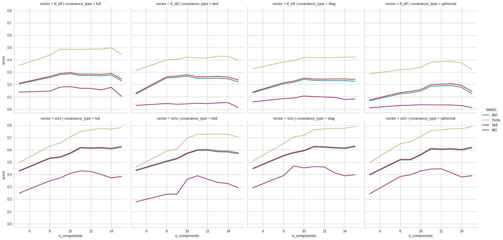


<div dir="rtl">
    <h4>
        بررسی max_iter برای tf_idf:
    </h4>
</div>


```python
max_iters = [50, 100, 200]
for max_iter in max_iters:
    print("max_iter: " + str(max_iter) + " --> AMI: " + str(gmm.get_AMI(tf_idf, tags, 14, 'full', max_iter)))
```

    max_iter: 50 --> AMI: 0.276425
    max_iter: 100 --> AMI: 0.276425
    max_iter: 200 --> AMI: 0.276425


<div dir="rtl">
    <h4>
        بررسی max_iter برای w2v:
    </h4>
</div>


```python
max_iters = [50, 100, 200]
for max_iter in max_iters:
    print("max_iter: " + str(max_iter) + " --> AMI: " + str(gmm.get_AMI(enhanced_w2v, tags, 14, 'full', max_iter)))
```

    max_iter: 50 --> AMI: 0.606647
    max_iter: 100 --> AMI: 0.606647
    max_iter: 200 --> AMI: 0.606647


<div dir="rtl">
        بنابراین max_iter تاثیر خاصی ندارد چون خیلی زود همگرا می‌شود و همان مقدار ۱۰۰ برایش مناسب است.
</div>

<div dir="rtl">
    <h4>
        نتایج برگزیده gmm:
    </h4>
</div>


```python
tfidf_param = {'n_components': 14, 'covariance_type': 'full', 'max_iter': 100}
w2v_param = {'n_components': 13, 'covariance_type': 'diag', 'max_iter': 100}
```


```python
gmm_results = gmm.get_evaluation_dataframe(tf_idf, tfidf_param, enhanced_w2v, w2v_param, tags)
gmm_results
```


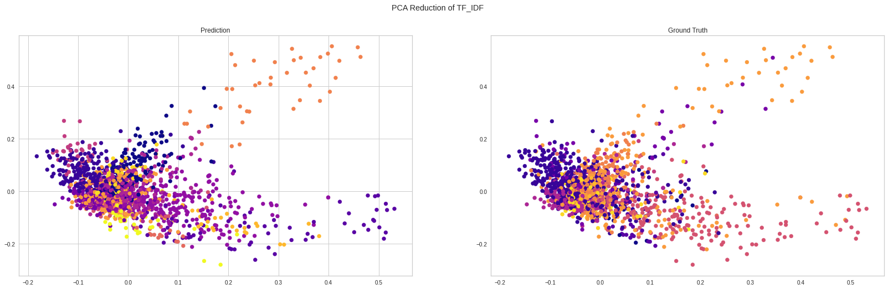


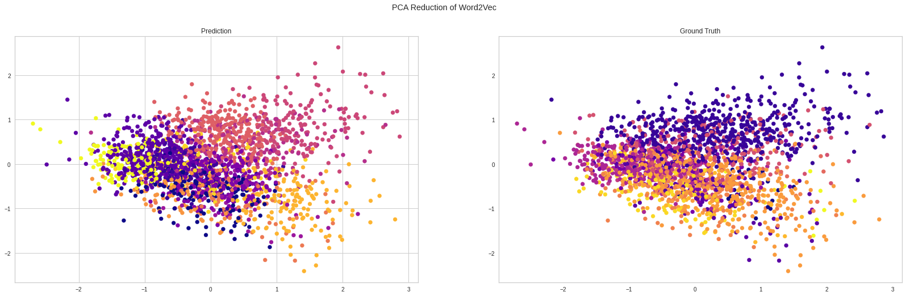


<div>
<style scoped>
    .dataframe tbody tr th:only-of-type {
        vertical-align: middle;
    }

    .dataframe tbody tr th {
        vertical-align: top;
    }

    .dataframe thead th {
        text-align: right;
    }
</style>
<table border="1" class="dataframe">
  <thead>
    <tr style="text-align: right;">
      <th></th>
      <th>Purity</th>
      <th>Adjusted Mutual Info</th>
      <th>Normalized Mutual Info</th>
      <th>Adjusted Rand Index</th>
    </tr>
  </thead>
  <tbody>
    <tr>
      <th>tf_idf</th>
      <td>0.497957</td>
      <td>0.276425</td>
      <td>0.289190</td>
      <td>0.176494</td>
    </tr>
    <tr>
      <th>w2v</th>
      <td>0.773945</td>
      <td>0.613305</td>
      <td>0.619435</td>
      <td>0.413222</td>
    </tr>
  </tbody>
</table>
</div>


<div dir="rtl">
    <h2>
        بررسی پارامترهای hierarchical:
    </h2>
    <p></p>
    از روش AgglomerativeClustering استفاده میکنیم.
    <p></p>
    دارای ۳ هایپرپارامتر مهم است: n_clusters, linkage, affinity
    <p></p>
    در k_means تعداد خوشه‌ها به صورت تجربی ۵ به دست آمد. از طرفی میدانیم ۱۴ دسته اصلی داریم. پس مقدار n_clusters را بین مقادیر ۵ تا ۱۵ بررسی میکنیم.
    <p></p>
    linkage چهار حالت دارد که هر ۴ مورد را بررسی میکنیم: ward, complete, average, single
    <p></p>
    affinity پنج حالت دارد: euclidean, l1, l2, manhattan.
    <p></p>
    این کارها به ازای tf_idf و w2v انجام می‌شود.
    <p></p>
    بنابراین ۲ * ۴ * ۴ * ۱۱ یعنی ۳۵۲ حالت باید بررسی شود.
</div>


```python
AMI_results_hier = hierarchical.get_result_df(tf_idf, enhanced_w2v, tags)
```


```python
AMI_results_hier.query('vector == "tf_idf" and metric == "AMI"').sort_values(by=['score'], ascending=False).head(10)
```


<div>
<style scoped>
    .dataframe tbody tr th:only-of-type {
        vertical-align: middle;
    }

    .dataframe tbody tr th {
        vertical-align: top;
    }

    .dataframe thead th {
        text-align: right;
    }
</style>
<table border="1" class="dataframe">
  <thead>
    <tr style="text-align: right;">
      <th></th>
      <th>vector</th>
      <th>n_clusters</th>
      <th>linkage</th>
      <th>affinity</th>
      <th>score</th>
      <th>metric</th>
    </tr>
  </thead>
  <tbody>
    <tr>
      <th>468</th>
      <td>tf_idf</td>
      <td>14</td>
      <td>ward</td>
      <td>euclidean</td>
      <td>0.265187</td>
      <td>AMI</td>
    </tr>
    <tr>
      <th>520</th>
      <td>tf_idf</td>
      <td>15</td>
      <td>ward</td>
      <td>euclidean</td>
      <td>0.262579</td>
      <td>AMI</td>
    </tr>
    <tr>
      <th>416</th>
      <td>tf_idf</td>
      <td>13</td>
      <td>ward</td>
      <td>euclidean</td>
      <td>0.238204</td>
      <td>AMI</td>
    </tr>
    <tr>
      <th>364</th>
      <td>tf_idf</td>
      <td>12</td>
      <td>ward</td>
      <td>euclidean</td>
      <td>0.231915</td>
      <td>AMI</td>
    </tr>
    <tr>
      <th>52</th>
      <td>tf_idf</td>
      <td>6</td>
      <td>ward</td>
      <td>euclidean</td>
      <td>0.219608</td>
      <td>AMI</td>
    </tr>
    <tr>
      <th>104</th>
      <td>tf_idf</td>
      <td>7</td>
      <td>ward</td>
      <td>euclidean</td>
      <td>0.218739</td>
      <td>AMI</td>
    </tr>
    <tr>
      <th>156</th>
      <td>tf_idf</td>
      <td>8</td>
      <td>ward</td>
      <td>euclidean</td>
      <td>0.218294</td>
      <td>AMI</td>
    </tr>
    <tr>
      <th>312</th>
      <td>tf_idf</td>
      <td>11</td>
      <td>ward</td>
      <td>euclidean</td>
      <td>0.216160</td>
      <td>AMI</td>
    </tr>
    <tr>
      <th>260</th>
      <td>tf_idf</td>
      <td>10</td>
      <td>ward</td>
      <td>euclidean</td>
      <td>0.215172</td>
      <td>AMI</td>
    </tr>
    <tr>
      <th>208</th>
      <td>tf_idf</td>
      <td>9</td>
      <td>ward</td>
      <td>euclidean</td>
      <td>0.213659</td>
      <td>AMI</td>
    </tr>
  </tbody>
</table>
</div>


```python
AMI_results_hier.query('vector == "w2v" and metric == "AMI"').sort_values(by=['score'], ascending=False).head(10)
```


<div>
<style scoped>
    .dataframe tbody tr th:only-of-type {
        vertical-align: middle;
    }

    .dataframe tbody tr th {
        vertical-align: top;
    }

    .dataframe thead th {
        text-align: right;
    }
</style>
<table border="1" class="dataframe">
  <thead>
    <tr style="text-align: right;">
      <th></th>
      <th>vector</th>
      <th>n_clusters</th>
      <th>linkage</th>
      <th>affinity</th>
      <th>score</th>
      <th>metric</th>
    </tr>
  </thead>
  <tbody>
    <tr>
      <th>988</th>
      <td>w2v</td>
      <td>13</td>
      <td>ward</td>
      <td>euclidean</td>
      <td>0.611991</td>
      <td>AMI</td>
    </tr>
    <tr>
      <th>780</th>
      <td>w2v</td>
      <td>9</td>
      <td>ward</td>
      <td>euclidean</td>
      <td>0.610846</td>
      <td>AMI</td>
    </tr>
    <tr>
      <th>1040</th>
      <td>w2v</td>
      <td>14</td>
      <td>ward</td>
      <td>euclidean</td>
      <td>0.603662</td>
      <td>AMI</td>
    </tr>
    <tr>
      <th>936</th>
      <td>w2v</td>
      <td>12</td>
      <td>ward</td>
      <td>euclidean</td>
      <td>0.602655</td>
      <td>AMI</td>
    </tr>
    <tr>
      <th>832</th>
      <td>w2v</td>
      <td>10</td>
      <td>ward</td>
      <td>euclidean</td>
      <td>0.602033</td>
      <td>AMI</td>
    </tr>
    <tr>
      <th>728</th>
      <td>w2v</td>
      <td>8</td>
      <td>ward</td>
      <td>euclidean</td>
      <td>0.600792</td>
      <td>AMI</td>
    </tr>
    <tr>
      <th>1092</th>
      <td>w2v</td>
      <td>15</td>
      <td>ward</td>
      <td>euclidean</td>
      <td>0.595704</td>
      <td>AMI</td>
    </tr>
    <tr>
      <th>884</th>
      <td>w2v</td>
      <td>11</td>
      <td>ward</td>
      <td>euclidean</td>
      <td>0.591347</td>
      <td>AMI</td>
    </tr>
    <tr>
      <th>676</th>
      <td>w2v</td>
      <td>7</td>
      <td>ward</td>
      <td>euclidean</td>
      <td>0.580189</td>
      <td>AMI</td>
    </tr>
    <tr>
      <th>624</th>
      <td>w2v</td>
      <td>6</td>
      <td>ward</td>
      <td>euclidean</td>
      <td>0.550198</td>
      <td>AMI</td>
    </tr>
  </tbody>
</table>
</div>


<div dir="rtl">
    <p></p>
    بنابراین می‌توان با قاطعیت گفت که linkaga=ward بهترین گزینه است برای tf_idf و w2v.
    <p></p>
    از طرفی ward تنها با euclidean سازگاری دارد. پس عملا همان حالت پیش‌فرض تابع نتیجه شد.
    <p></p>
    n_clusters برای tf_idf بین ۱۴ و ۱۵ نتیجه خوب داده‌است بنابراین تعداد خوشه‌ها را ۱۴ در نظر میگیرم.
    <p></p>
    برای w2v تعداد خوشه‌ها بین ۹ تا ۱۴ جواب معقول و بهینه‌ای داده‌است اما ۱۱ و ۱۳ بهینه‌تر از بقیه هستند. با توجه به اینکه تعداد دسته‌های اصلی ۱۴ تاست، بین ۱۱ و ۱۳ مقدار ۱۳ را به عنوان تعداد خوشه انتخاب می‌کنیم.
</div>


```python
sns.relplot(data=AMI_results_hier, x='n_clusters', y='score', row='vector', col='linkage', hue="metric", kind='line');
```


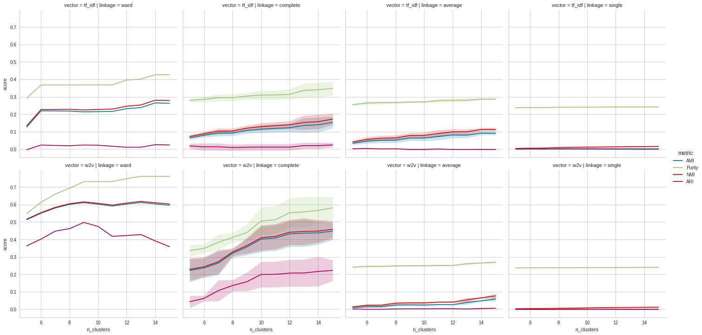


```python
hierarchical.show_dendrogram(tf_idf, 'ward', 'euclidean')
```


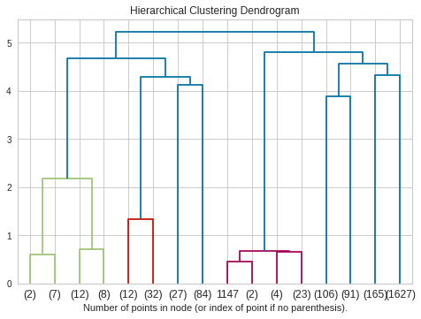


<div dir="rtl">
    در نمودار بالا تعداد دسته‌ها ۱۶ تا است که این عدد نزدیک به تعداد خوشه‌های tf_idf یعنی ۱۴ است. اگر دقت شود دو دسته دارای تنها ۲ عضو هستند که با حذف آن‌ها به همان ۱۴ دسته میرسیم.
</div>


```python
hierarchical.show_dendrogram(enhanced_w2v, 'ward', 'euclidean')
```


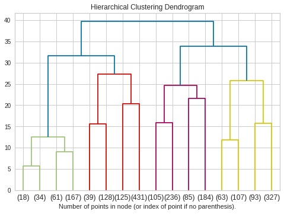


<div dir="rtl">
    در نمودار بالا تعداد دسته‌ها ۱۶ تاست که با مرج کردن دسته‌های زیر ۱۰۰ عضو به ۱۳ دسته میرسیم که همان تعداد خوشه‌های w2v است.
</div>

<div dir="rtl">
    <h4>
        نتایج برگزیده hierarchical:
    </h4>
</div>


```python
tfidf_param = {'n_clusters': 14, 'linkage': 'ward', 'affinity': 'euclidean'}
w2v_param = {'n_clusters': 13, 'linkage': 'ward', 'affinity': 'euclidean'}
```


```python
hierarchical_results = hierarchical.get_evaluation_dataframe(tf_idf, tfidf_param, enhanced_w2v, w2v_param, tags)
hierarchical_results
```


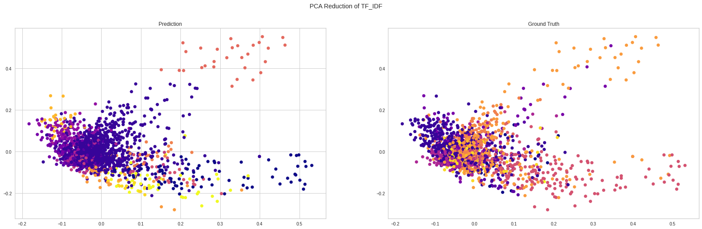


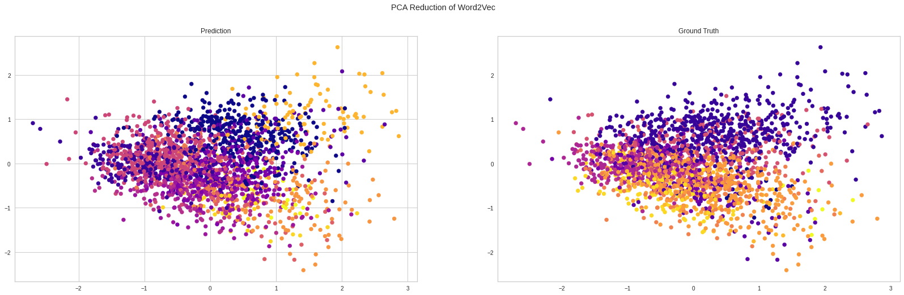


<div>
<style scoped>
    .dataframe tbody tr th:only-of-type {
        vertical-align: middle;
    }

    .dataframe tbody tr th {
        vertical-align: top;
    }

    .dataframe thead th {
        text-align: right;
    }
</style>
<table border="1" class="dataframe">
  <thead>
    <tr style="text-align: right;">
      <th></th>
      <th>Purity</th>
      <th>Adjusted Mutual Info</th>
      <th>Normalized Mutual Info</th>
      <th>Adjusted Rand Index</th>
    </tr>
  </thead>
  <tbody>
    <tr>
      <th>tf_idf</th>
      <td>0.426691</td>
      <td>0.265187</td>
      <td>0.280486</td>
      <td>0.025559</td>
    </tr>
    <tr>
      <th>w2v</th>
      <td>0.761235</td>
      <td>0.611991</td>
      <td>0.618243</td>
      <td>0.428166</td>
    </tr>
  </tbody>
</table>
</div>


<div dir="rtl">
    <h2>
        نتایج نهایی خوشه‌بند‌ها:
    </h2>
</div>

<div dir="rtl">
    <h4>
        پارامترهای برگزیده kmeans:
    </h4>
</div>


```python
kmeans_tfidf_param = {'n_clusters': 14, 'n_init': 10, 'max_iter': 300, 'random_state': best_random_tfidf}
kmeans_w2v_param = {'n_clusters': 14, 'n_init': 10, 'max_iter': 300, 'random_state': best_random_w2v}
kmeans_df = k_means.final(tf_idf, kmeans_tfidf_param, enhanced_w2v, kmeans_w2v_param, tags, links)
```

<div dir="rtl">
    <h4>
        پارامترهای برگزیده gmm:
    </h4>
</div>


```python
gmm_tfidf_param = {'n_components': 14, 'covariance_type': 'full', 'max_iter': 100}
gmm_w2v_param = {'n_components': 13, 'covariance_type': 'diag', 'max_iter': 100}
gmm_df = gmm.final(tf_idf, gmm_tfidf_param, enhanced_w2v, gmm_w2v_param, tags, links)
```

<div dir="rtl">
    <h4>
        پارامترهای برگزیده hierarchical:
    </h4>
</div>


```python
hierarchical_tfidf_param = {'n_clusters': 14, 'linkage': 'ward', 'affinity': 'euclidean'}
hierarchical_w2v_param = {'n_clusters': 13, 'linkage': 'ward', 'affinity': 'euclidean'}
hierarchical_df = hierarchical.final(tf_idf, hierarchical_tfidf_param, enhanced_w2v, hierarchical_w2v_param, tags, links)
```

<div dir="rtl">
    <h4>
        نتایج نهایی:
    </h4>
</div>


```python
pd.concat([kmeans_df, gmm_df, hierarchical_df], axis=0, ignore_index=True)
```


<div>
<style scoped>
    .dataframe tbody tr th:only-of-type {
        vertical-align: middle;
    }

    .dataframe tbody tr th {
        vertical-align: top;
    }

    .dataframe thead th {
        text-align: right;
    }
</style>
<table border="1" class="dataframe">
  <thead>
    <tr style="text-align: right;">
      <th></th>
      <th>method</th>
      <th>vector</th>
      <th>Purity</th>
      <th>Adjusted Mutual Info</th>
      <th>Normalized Mutual Info</th>
      <th>Adjusted Rand Index</th>
    </tr>
  </thead>
  <tbody>
    <tr>
      <th>0</th>
      <td>Kmeans</td>
      <td>tf_idf</td>
      <td>0.474353</td>
      <td>0.287757</td>
      <td>0.300890</td>
      <td>0.102612</td>
    </tr>
    <tr>
      <th>1</th>
      <td>Kmeans</td>
      <td>w2v</td>
      <td>0.785293</td>
      <td>0.626236</td>
      <td>0.632622</td>
      <td>0.422076</td>
    </tr>
    <tr>
      <th>2</th>
      <td>GMM</td>
      <td>tf_idf</td>
      <td>0.497957</td>
      <td>0.276425</td>
      <td>0.289190</td>
      <td>0.176494</td>
    </tr>
    <tr>
      <th>3</th>
      <td>GMM</td>
      <td>w2v</td>
      <td>0.773945</td>
      <td>0.613305</td>
      <td>0.619435</td>
      <td>0.413222</td>
    </tr>
    <tr>
      <th>4</th>
      <td>Hierarchical</td>
      <td>tf_idf</td>
      <td>0.426691</td>
      <td>0.265187</td>
      <td>0.280486</td>
      <td>0.025559</td>
    </tr>
    <tr>
      <th>5</th>
      <td>Hierarchical</td>
      <td>w2v</td>
      <td>0.761235</td>
      <td>0.611991</td>
      <td>0.618243</td>
      <td>0.428166</td>
    </tr>
  </tbody>
</table>
</div>


